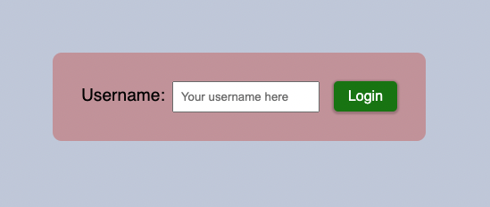
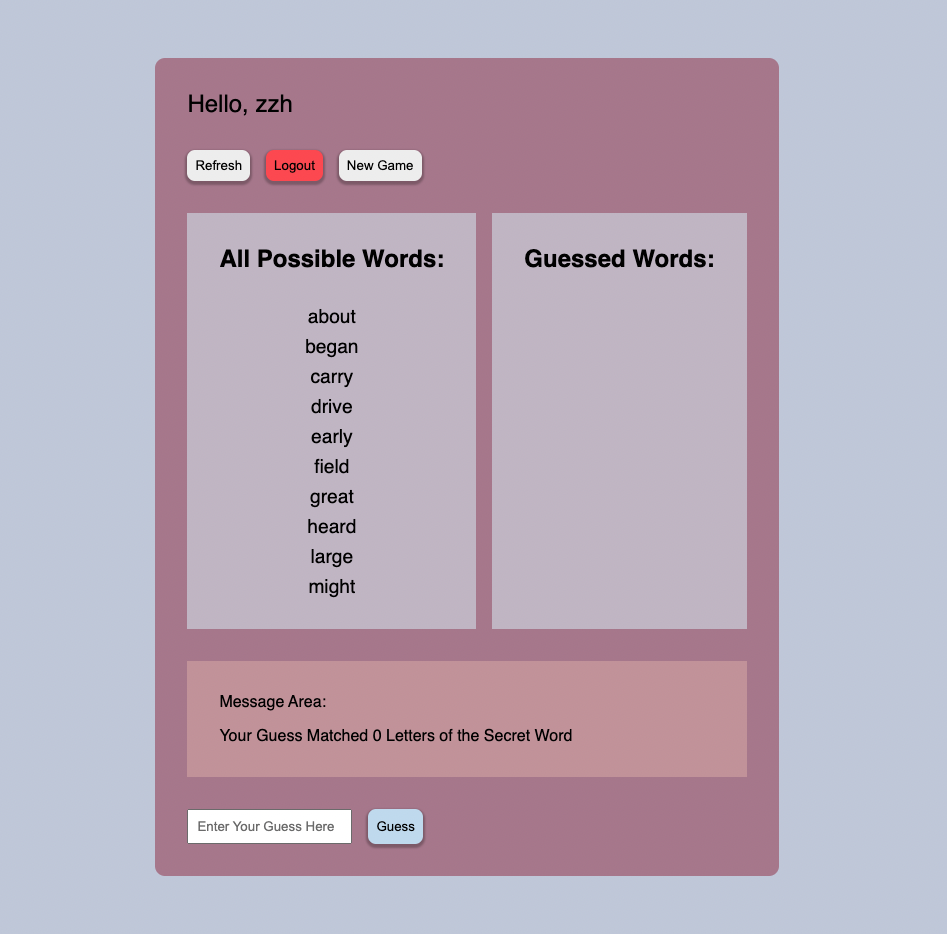

# Guess the Secret Word

This is a word guessing game. The goal is to guess the randomly generated secret word out of a list of potential words which will be given to the user. Each time the program will tell the user how many letters their guess have matched with the secret word, and users can adjust their guess based on that hint, until they win. Once hitting the right answer, a message will be prompted in the message area to inform the user. Then they can decide to start a new game or leave the game.

---

## How to Use

Inside the directory, the same level as this README file is located. Run the following commands in the terminal:

1. `npm install`
2. `npm run build`
3. `npm start`

---

## Login First

First the user needs to login to play the game. All you need to do is to type in a username and hit the login button. The username can only contain letters and numbers, and it can never be "dog".

When you logged in, you will be prompted to the game interface. On the very top there will be a greeting message containing your username.

---

## Control Buttons

Blew the greeting message are three buttons: Refresh, Logout, New Game. Their functions are suggested by their names.

- **Refresh** button will refresh the page without erasing the state, works the same as the reload button on your browser.
- **Logout** button will log out the current user and bring the user back to the login form page. All data will be resumed once the user logs back in.
- **New Game** button will erase the current state, reset all data and restart the game.

---

## Word Lists

In the middle there are two word lists. On the left is the all possible words list. On the right is the list of all the previously guessed words. Once you start guessing, this list will be updated automatically.

---

## Message Area

This area will provide useful information to the users. It will display the last guessed word, hints on the number of matched letters, and some potential error messages

---

## Guess Word Form

At the very bottom is a form to submit new guesses. You can type in any word you like, the system won't stop you, but it will display corresponding error messages if the guess is incorrect or impossible.

---

For grading purpose, there will be a console.log message showing the secret word printed to the browser console each time a new game is loaded.
